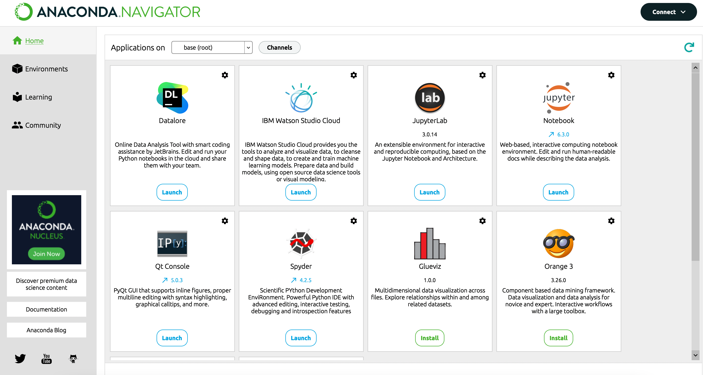
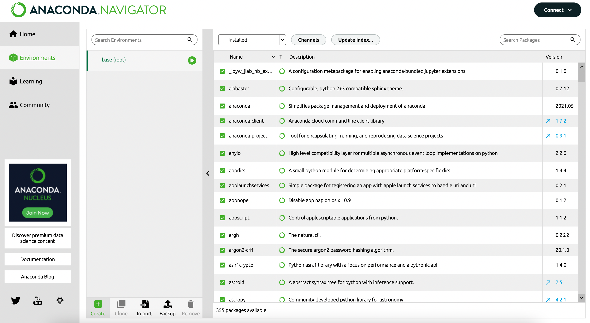
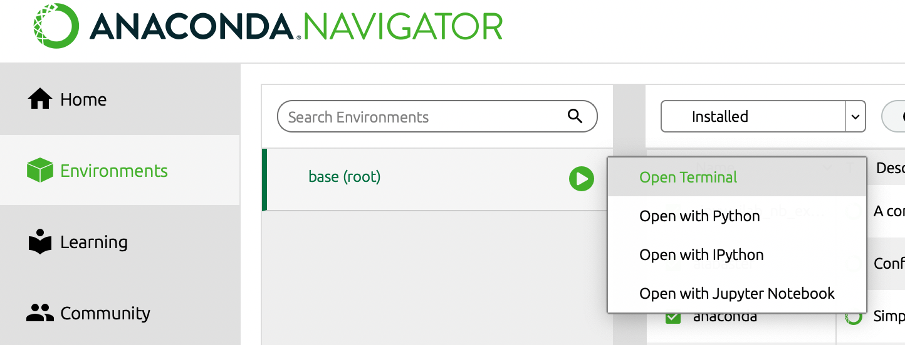
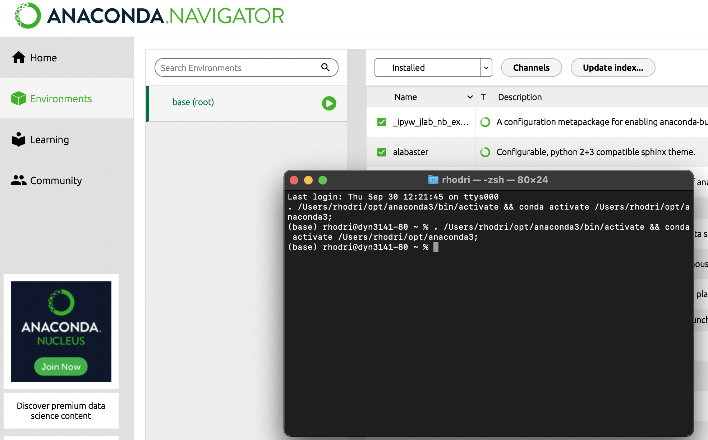
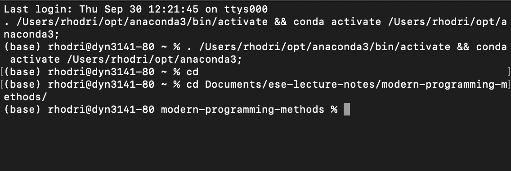
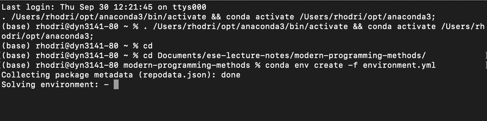
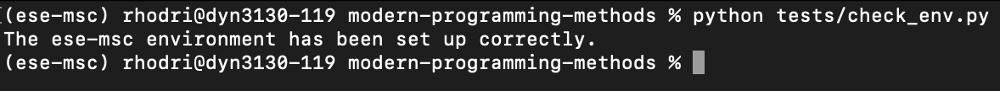
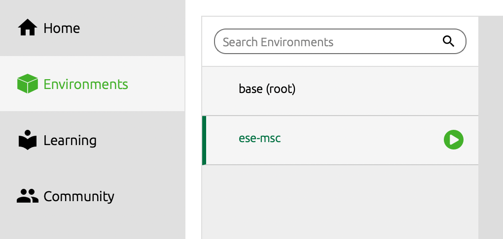
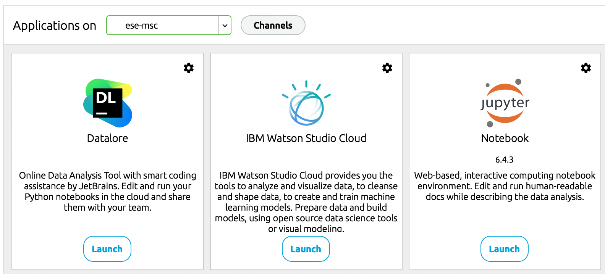
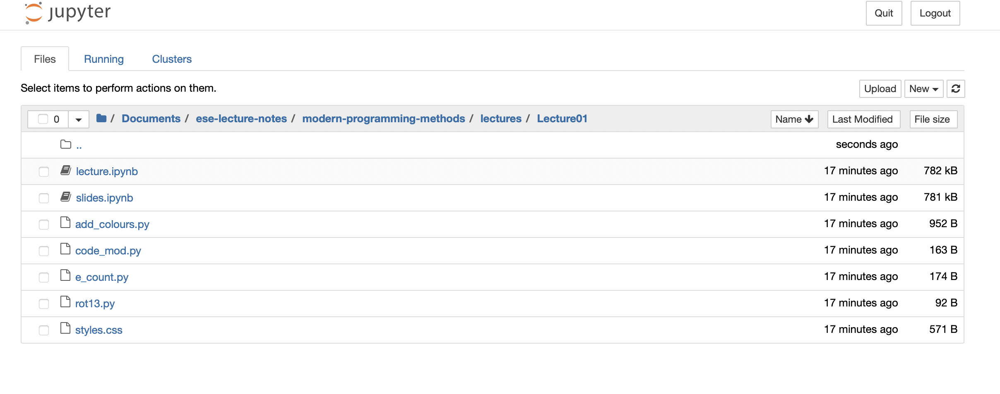

# Modern Programming Practices

## Learning outcomes:
On successful completion of this module, students will be able to:
 1.	Produce software for sustainable and reproducible research.
 2.	Carry out test-driven software development and continuous integration.
 3.	Develop software using a version control system.
 4.	Create software using the Python programming language.

## Description of contents:
The module will include cover the following topics:
 1.	Software version control: This is necessary to maintain a detailed record of software as it is developed, including how to work collaboratively. While the skills are portable across many software version control systems, this modules will use git with GitHub.
 2.	Test driven development and continuous integration: Software development is planned around the tests that can be written to ensure correctness, while software version control is integrated with automated testing to monitor software health on a continuous basis. 
 3.	Students will be taught how to program in Python and how to use a range of Python modules to perform compute-intensive and data-intensive tasks.

## Preparation:

Prior to beginning this course it is recommended that [Anaconda](https://www.anaconda.com/products/individual) is installed on your machine. You will learn more about Python Environments in the third lecture of this course, but before that we recommend creating the `ese-msc` environment from the `environment.yml` file found in this repository. This
is to avoid 'polluting' the Anaconda base environment and hence a potential re-installation down the line. Instructions for creating the environment via the
Anaconda-Navigator are given below.

**Note** that if you are already comfortable with Anaconda and/or `venv`, `virtualenv` etc. please create the environment using your preferred method. Further,
the screenshots in the instructions below are from setup on a MacBook Air. The instructions are however also valid for Windows based machines.

#### Creating the `ese-msc` environment

Upon opening the Navigator for the first time you'll see something like the following:



If you click on the 'Environments' tab you will then see the currently available environments and the currently loaded environment highlighted. In new installations,
only the `base (root)` environment will exist. We will now create a new `ese-msc` environment from the `environment.yml` found in this repository:



Unfortunately there is currently a bug with importing environments via the GUI, we will therefore use a slightly different method here. If we click on the green arrow next
to the highlighted `base (root)` environment we will see the following:



We now need to click on **Open Terminal** to open a terminal as shown below:



Next, we need to navigate to the location where we cloned/downloaded the lecture notes. This done by typing
```
cd /path/to/modern-programming-methods
```
in the terminal (where `/path/to/` should of course be replaced by the correct path on your machine).



Once in the `modern-programming-methods` directory
(note that the path of your current directory can be checked via the `pwd` command - short for 'public working directory') the `ese-msc` environment can be
created by typing
```
conda env create -f environment.yml
```
This may take a little while to run.



Upon completion the `ese-msc` environment is now ready for use. To ensure it has been setup correctly you can **activate the environment** and then run
the `check_env.py` script located in the `tests/` folder. In the terminal type
```
conda activate ese-msc
```
followed by
```
python tests/check_env.py
```
Upon a successful creation you'll the the message `The ese-msc environment has been set up correctly.` as in the screenshots below:



If there has been a problem you will instead see `There has been a problem with the creation of the ese-msc environment.` and should repeat the steps outlined above.
Following a success message you can now close the terminal and return to the GUI. The `ese-msc` environment can be activated
by clicking on it in the 'Environments' tab in the navigator.



With the `ese-msc` environment activated, if we now click on the `Home` tab on the left hand side of the navigator we will see something like the following:



Note the `ese-msc` next to the 'Applications on'. Finally, we wish to navigate to the relevant Jupyter Notebook. Clicking 'Launch' under the Jupyter Notebook app
will open a navigator:



We can then navigate to the appropriate lecture and open the **lecture.ipynb** file.

## Supplementary/recommended reading:
* http://scipy-lectures.org
* https://stackoverflow.com
* A Primer on Scientific Programming with Python, by Hans Petter Langtangen
* Algorithms, by Robert Sedgewick and Kevin Wayne
* Bits and bugs, by Thomas Huckle and Tobias Neckel

## Lecture schedule

|Date                      | Lecture                             |Instructor  |Moderator   |
|--------------------------|-------------------------------------|------------|------------|
|2021-10-11 9:00-12:00 Mon |Scipy, Sympy, etc.                   |G. Gorman   |R. Nelson   |
|2021-10-12 9:00-12:00 Tue |Python development                   |J. Percival | M. Beg  |
|2021-10-13 9:00-12:00 Wed |Environments                         |R. Nelson   |J. Percival |
|2021-10-14 9:00-12:00 Thu |Software Testing                     |J. Percival |R. Nelson   |
|2021-10-15 9:00-12:00 Fri |Drop-in session (optional)           |            |            |
|2021-10-18 9:00-12:00 Mon |The Cloud & Azure I                  |J. Percival |R. Nelson   |
|2021-10-19 9:00-12:00 Tue |Pandas - Python Data Processing      |R. Nelson   |J. F. van Schalkwyk |
|2021-10-20 Wed | _no events (Imperial Graduation Day)_           |            |            |
|2021-10-21 9:00-12:00 Thu |The Cloud & Azure II                 |J. Percival |R. Nelson   |
|2021-10-22 9:00-12:00 Fri |Continuous Integration & Delivery    |R. Nelson   |J. Percival |
|2021-10-25 9:00-12:00 Mon |Floating Point Representation        |M. Beg   |R. Nelson   |
|2021-10-26 9:00-12:00 Tue |Debugging                            |R. Nelson   |J. Percival   |
|2021-10-27 9:00-12:00 Wed |Code Optimization & Profiling        |M. Beg   |J. Percival |
|2021-10-28 9:00-12:00 Thu |Parallel Processing in Python & Dask |J. Percival   |M. Beg |
|2021-10-29 9:00-12:00 Fri |Drop-in session (optional)           |            |            |

## Assessment exercises

Assessment will be 100% by coursework. Exercises will be distributed and submitted via GitHub

|Release Date  | Due Date            | Topic                             |
|--------------|---------------------|-----------------------------------|
|2021-10-12 Tue| 2021-10-15 16:00 Fri| Python modules (cellular automata)|
|2021-10-19 Tue| 2021-10-22 16:00 Fri| Pandas/Azure                      |
|2021-10-26 Tue| 2021-10-29 16:00 Fri| Debugging/CI                      |


